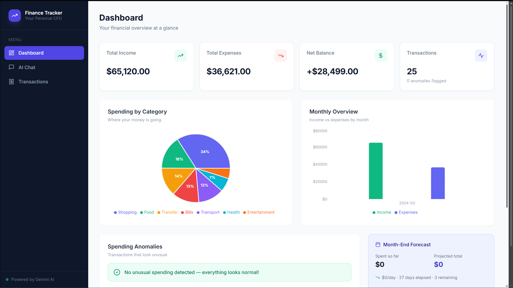
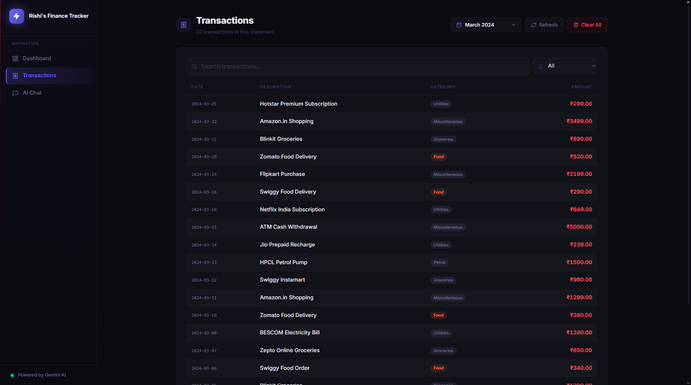
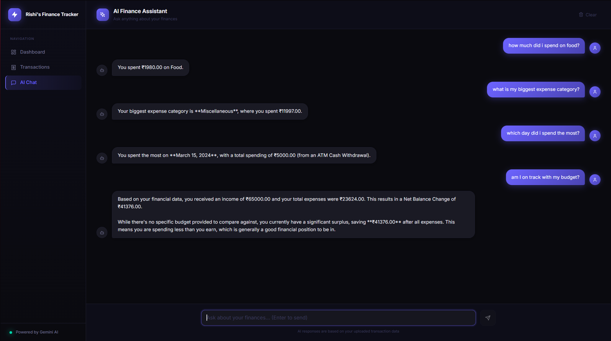

# AI Finance Tracker

A web app that parses your bank statement PDFs, categorizes transactions automatically, and gives you an actual picture of your financial health — not just a spreadsheet.

Built this for myself — I'm a final year student living alone and wanted something smarter than manually tagging transactions in a notes app.





---

## What It Does

- **PDF Upload** — drop in your bank statement, Gemini reads it and extracts every transaction with a date, amount, and category
- **Auto-categorization** — transactions are sorted into Food, Petrol, Groceries, Utilities, and Miscellaneous automatically
- **Financial Health Score** — a score out of 100 based on your savings rate, spending patterns, and income consistency, with breakdown bars showing where points are gained or lost
- **AI Spending Insights** — detects behavioral patterns and writes short narratives about your spending ("you spend 40% more on weekends", "your food spend peaks mid-month")
- **What If Simulator** — interactive slider to cut spending in any category by a percentage and see the projected monthly savings
- **Recurring Payments Detector** — automatically surfaces subscriptions and regular bills from your transactions
- **AI Chat** — ask things like "how much did I spend on food this month?" or "am I saving more than last month?" and get answers from your actual data
- **Anomaly Detection** — flags transactions that look unusually large compared to your normal spend in that category
- **Month-end Forecast** — estimates where your balance will land by end of month based on your current spending pace
- **Privacy First** — everything is processed locally, and the uploaded PDF is deleted from the server immediately after parsing

---

## Tech Stack

| Part | What I used | Why |
|------|-------------|-----|
| Frontend | React + Tailwind + Vite | Just what I know |
| Backend | FastAPI (Python) | Fast to build, automatic docs |
| Database | SQLite | No setup, runs locally, good enough |
| AI | Google Gemini 2.0 Flash | Free tier, handles messy PDFs well |
| PDF parsing | pdfplumber | Extracts tables from PDFs reliably |
| Charts | Recharts | Easy to use with React |

Everything runs locally. No cloud hosting, no data leaving your machine after parsing.

---

## Setup

You'll need Python 3.10+ and Node 18+.

### 1. Get a free Gemini API key

Go to [aistudio.google.com](https://aistudio.google.com), sign in with Google, and create an API key.

### 2. Backend

```bash
cd backend

python -m venv venv
venv\Scripts\activate        # Windows
# source venv/bin/activate   # Mac/Linux

pip install -r requirements.txt

copy .env.example .env
# Open .env and add your Gemini API key
```

### 3. Start the backend

```bash
uvicorn main:app --reload
```

Leave this terminal open. Backend runs on `http://localhost:8000`.

### 4. Frontend

Open a second terminal:

```bash
cd frontend
npm install
npm run dev
```

### 5. Open the app

Go to `http://localhost:5173` in your browser.

---

## How to Use

**Uploading:** Drag and drop your bank statement PDF on the dashboard. Takes 15–30 seconds to process. Needs to be a digital PDF (downloaded from your bank's website), not a scanned image. The file is deleted from the server once parsing is done.

**Health Score:** Shows your overall financial health out of 100 with a breakdown of what's helping and what's dragging it down.

**Insights:** Scroll past the dashboard for AI-written narratives about your behavioral patterns — updated each time you upload a new statement.

**What If:** Use the sliders to simulate cutting spending in a category and see how much you'd save in a month.

**Recurring Payments:** Lists transactions that appear regularly so you can see exactly what you're subscribed to.

**Chat:** Ask questions in plain English — it has your full transaction history as context.

**Anomalies:** Transactions flagged with ⚠️ are unusually large for that category.

**Forecast:** Shows projected month-end balance based on your daily spending rate so far this month.

---

## Troubleshooting

**"GEMINI_API_KEY is not set"** — Create `backend/.env` and add `GEMINI_API_KEY=your_key_here`. See `.env.example` for the format.

**Upload fails with "Could not extract text"** — Your PDF is probably a scanned image. Download a fresh copy from your bank's internet banking portal.

**Frontend can't connect to backend** — Make sure uvicorn is still running on port 8000.

**Gemini quota errors (429)** — The app retries automatically 3 times with a 20 second wait. If it still fails, wait a minute and try again.
